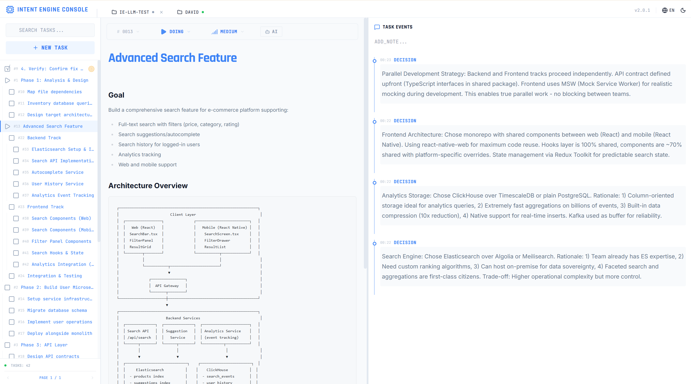

# Intent-Engine

**[中文](Readme.zh.md) | English**

[](https://github.com/wayfind/intent-engine/actions/workflows/ci.yml)
[](https://crates.io/crates/intent-engine)
[](https://www.npmjs.com/package/@origintask/intent-engine)
[](./LICENSE-MIT)

**Persistent memory for AI coding assistants.**

---

## AI Forgets. Every Time.

**Without Intent-Engine:**
```
Day 1: "Build authentication"
       AI works brilliantly...
       [session ends]

Day 2: "Continue auth"
       AI: "What authentication?"
```

**With Intent-Engine:**
```
Day 1: "Build authentication"
       AI works, saves progress...
       [session ends]

Day 2: "Continue auth"
       AI: "Resuming #42: JWT auth.
            Done: token generation.
            Next: refresh tokens."
```

**One command restores everything:** `ie status`

---

## Visual Dashboard

See your entire task structure at a glance:

```bash
ie dashboard
```



**Features:**
- **Task Navigator** — Hierarchical tree view with search
- **Task Detail** — Full spec with markdown rendering (mermaid diagrams, code blocks)
- **Decision Timeline** — Chronological log of all decisions and notes
- **Multi-project Support** — Switch between projects via tabs

---

## Not Just Memory — Infrastructure

What actually happens when things go wrong:

- **Session ends** → ✓ Persisted
- **Tool crashes** → ✓ Recoverable
- **Week later** → ✓ Full history
- **Multiple agents** → ✓ Isolated
- **Complex project** → ✓ Focus-driven

---

## Why It Works

**Minimal Footprint** — ~200 tokens overhead, single binary, no daemons

**Battle-Tested Stack** — Rust + SQLite + FTS5, GB-scale in milliseconds, local-only

---

## The Bigger Picture

> **The unsolved problem in AI agents: tasks that span days or weeks.**

Intent-Engine provides the foundation:

```
Week-long refactoring:

├── Agent A (session: "api")    → focus: #12 REST endpoints
├── Agent B (session: "db")     → focus: #15 Schema migration
└── Agent C (session: "test")   → focus: #18 Integration tests
                                  depends_on: [#12, #15]
```

- **Interruptions** → Persistent memory
- **Multi-agent** → Session isolation
- **Scheduling** → Dependency graph (`depends_on`)
- **Context explosion** → Focus-driven retrieval

**Result:** Reliable multi-day, multi-agent workflows.

---

## Get Started

### Claude Code (recommended)

```bash
/plugin marketplace add wayfind/origin-task
/plugin install intent-engine
```

### OpenCode

```bash
curl -fsSL https://raw.githubusercontent.com/wayfind/intent-engine/main/opencode-plugin/intent-engine.ts \
  -o ~/.config/opencode/plugin/intent-engine.ts
```

### Manual Install

```bash
# Choose one
npm install -g @origintask/intent-engine
brew install wayfind/tap/intent-engine
cargo install intent-engine

# Or use the install script
curl -fsSL https://raw.githubusercontent.com/wayfind/intent-engine/main/scripts/install/ie-manager.sh | sh -s install
```

### Core Commands

```bash
ie status                         # Restore context
ie dashboard                      # Open visual dashboard
echo '{"tasks":[...]}' | ie plan  # Create/update tasks
ie log decision "chose X"         # Record decisions
ie search "keyword"               # Search history
```

### LLM-Powered Features (Optional)

**Event-to-Task Synthesis** - Automatically generate structured task summaries from event history:

```bash
# Configure LLM (one-time setup)
ie config set llm.endpoint "http://localhost:8080/v1/chat/completions"
ie config set llm.api_key "sk-your-key"
ie config set llm.model "gpt-3.5-turbo"  # Or local model

# Test connection
ie config test-llm

# Now when completing tasks, synthesis happens automatically for AI-owned tasks
ie task done 42  # Generates structured Goal/Approach/Decisions/Outcome summary
```

**Cost Awareness**:
- ~1,500 tokens per synthesis (~$0.003 with GPT-3.5-turbo)
- 20 tasks/day ≈ $22/year with GPT-3.5, or use local models (free)
- Synthesis only happens when LLM configured (graceful degradation)
- See [LLM Use Cases](docs/design/llm-use-cases.md) for full details

---

## How It Works

```
Session Start  →  ie status  →  Full context restored
                                       ↓
Working        →  ie plan    →  Tasks tracked
               →  ie log     →  Decisions recorded
                                       ↓
Interruption   →  Auto-persisted
                                       ↓
Next Session   →  ie status  →  Continue where you left off
```

---

## Documentation

- **[Quick Start](docs/en/guide/quickstart.md)** — Get running in 5 minutes
- **[Dashboard Guide](docs/dashboard-user-guide.md)** — Visual interface walkthrough
- **[CLAUDE.md](CLAUDE.md)** — AI integration guide
- **[Commands](docs/en/guide/command-reference-full.md)** — Full reference

---

**MIT OR Apache-2.0** · [GitHub](https://github.com/wayfind/intent-engine)

*Give your AI the memory it deserves.*
